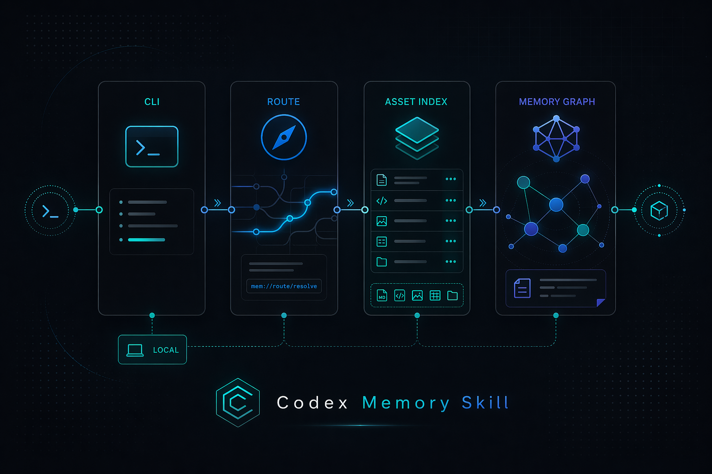

[中文文档](README.zh-CN.md)

<p align="center">
  
</p>

<h1 align="center">Codex Memory Skill</h1>

<p align="center">
  Local-first, skill-native, testable memory workflow for coding agents.
</p>

<p align="center">
  
</p>

## Why

Code agents become more useful when project knowledge is stored as something searchable, routable, and benchmarkable instead of disappearing into chat history.

Codex Memory Skill packages that workflow into a local CLI plus a reusable skill bundle:

- local route and capability search
- project memory bootstrap
- asset index generation
- optional semantic rerank
- checkpoint and promotion flow
- L4 session archive and replay
- benchmark and hygiene tooling

The core workflow runs locally. No hosted API is required for route or capability search.

## Features

- **Route queries locally** with `codex-memo r --task "..."`
- **Search capabilities locally** with `codex-memo q --task "..."`
- **Bootstrap a project memory layer** with `codex-memo b`
- **Build an asset index** with `codex-memo a`
- **Run hygiene checks** with `codex-memo c`
- **Replay benchmark cases** with `scripts/memory_benchmark.py`
- **Enable optional semantic extras** with `numpy` + `sentence-transformers`
- **Keep the workflow testable** with built-in smoke tests

## Repository Layout

```text
bin/
  codex-memo                 # CLI entry point

scripts/
  codex_memo.py              # CLI dispatch
  memory_tool.py             # Core memory operations
  build_asset_index.py       # Asset index builder
  memory_benchmark.py        # Benchmark runner
  lib/                       # Shared internals

skills/
  project-memory-loop/       # Reusable skill bundle

examples/
  benchmark-cases.json       # Benchmark cases

tests/
  test_smoke.py              # Smoke tests
```

## Quick Start

```bash
git clone <repo-url> codex-memory-skill
cd codex-memory-skill

chmod +x bin/codex-memo
./bin/codex-memo --help
```

Bootstrap memory into a target project:

```bash
cd /path/to/your-project
/path/to/codex-memory-skill/bin/codex-memo b
```

## Core Commands

```bash
# Route a task to the best matching memory / skill
codex-memo r --task "restore previous chat history"

# Search local capabilities
codex-memo q --task "working checkpoint"

# Build the local asset index
codex-memo a

# Run hygiene checks
codex-memo c

# Replay the benchmark suite
python3 scripts/memory_benchmark.py --repo-root . --cases examples/benchmark-cases.json
```

## Validation

Smoke tests in this packaged repository:

```bash
python3 -m unittest discover -s tests -p 'test_*.py'
```

Current result:

- **3 / 3 smoke tests passed**

Local baseline from the source system:

| Operation | Result |
|---|---|
| Route | 130 / 130 success, top-1 100%, p50 445 ms |
| Capability search | 64 / 64 success, p50 139 ms |

## Optional Semantic Extras

For stronger fuzzy matching:

```bash
pip install numpy sentence-transformers
```

These dependencies are optional. The core workflow still runs without them.

## Scope

Codex Memory Skill is strongest as a **local-first memory workflow**:

- local execution
- transparent files and scripts
- benchmarkable retrieval
- skill-native integration

It is not a hosted memory platform, not a multi-tenant SaaS product, and not a general-purpose vector database.

## Roadmap

- cleaner install story
- more public examples
- expanded benchmark coverage
- more portable packaging around the skill bundle
